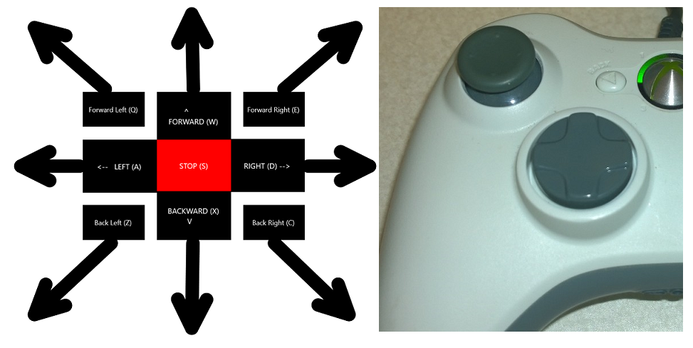
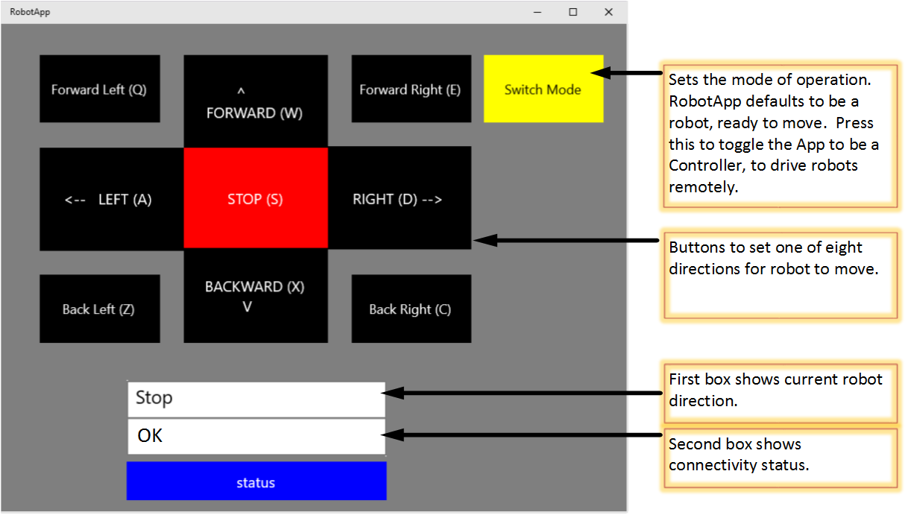
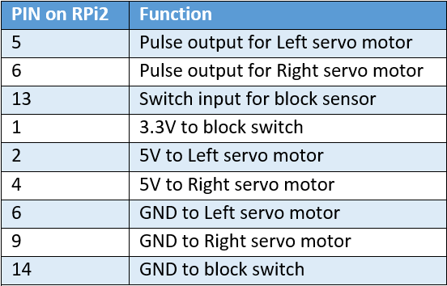

# Welcome: Say hello to your little friend!
You are about to embark on a journey, and we are excited to be part of it! Get ready to make and program your robot using Windows 10!

By the time you are done with this project you will gain the following experience:

1. Understand how [Windows 10 Universal Applications (UAP)](http://blogs.windows.com/buildingapps/2014/09/30/universal-windows-apps-get-better-with-windows-10/) work
2. See how the same application can come alive and change behavior by running on the robot via Windows 10 on a Raspberry Pi 2 **and** on your Windows 10 Desktop PC  
3. Program a UAP, using C# and XAML
4. Control digital [GPIO](https://www.youtube.com/watch?v=jwWxKACHWxs) from your [Raspberry Pi 2](https://www.raspberrypi.org/products/raspberry-pi-2-model-b/)
5. Use GPIO and timers to power a servo motor
6. React to a toggled switch
7. Process USB Joystick information
8. Send and receive networking commands
9. Process keyboard, mouse clicks and touch events

We are excited to embark on this journey with you - Thank you from the Microsoft IoT Team!

# Usage
Download the project, load it into Visual Studio compile and deploy the application. Follow this **example (TBD)**

The application can be run in 2 ways:

1. **Windows 10 desktop UAP** - here you can use the mouse or touch to drive the robot. You can also plug in the Xbox 360 controller and use that to drive the robot over the network
2. **Windows 10 UAP for the Raspberry pi 2** - here you can drive the robot directly with the Xbox 360 controller, or via network commands from the Windows 10 UAP

## Directional movement
The robot can move in 8 directions:

1. Forward
2. Reverse
3. Hard left turn
4. Hard right turn
5. Soft forward left turn
6. Soft forward right turn
7. Soft backward left turn
8. Soft backward right turn

A **hard** turn rotates the wheels in opposite directions. A **soft** turn rotates only one wheel in the specified direction.

## Joystick Input
The robot can be controlled via the left analog stick or digital direction pad.
They joystick can be plugged into the robot directly via the USB port on the Raspberry Pi 2 or the Windows 10 Desktop PC via USB.

## Keyboard Input
From the Windows 10 Desktop PC UAP app, the keyboard controls are:

* Forward - Up arrow / W
* Backward - Down arrow / X
* Left - Left arrow / A
* Right - Right arrow / D
* Back Left - Z
* Back Right - C
* Forward Left - Q
* Forward Right - E
* Stop - Enter / Space

## Mouse/Touch
When run on the Windows 10 Desktop PC, there is an input screen with the 8 directional movements of the robot.
Click or touch any of these to move the robot.

# Bill of Materials
To build the robot, you will need the following:

1. Wooden Robot Frame in 7 pieces - Get the cutting plans from the [Sumo Robot Jr. GitHub repo] (https://github.com/makenai/sumobot-jr/tree/master/cutting_plans) and submit them to [http://ponoko.com] (https://ponoko.com ). We cut them 4 to a sheet of [P3 5.2 mm Veneer Core Birch] (http://www.ponoko.com/make-and-sell/show-material/84-veneer-core-birch) 
2. 2x continuous rotation servos, like [these](https://www.pololu.com/product/1248)
3. A ball caster, like [this](https://www.pololu.com/product/953)
4. A [USB Xbox 360 Controller](http://www.amazon.com/Microsoft-Xbox-360-Controller-Windows/dp/B004QRKWLA/ref=sr_1_1?ie=UTF8&qid=1429227502&sr=8-1&keywords=usb+xbox+360+controller)
5. a Digital switch, like [this](http://www.digikey.com/product-detail/en/D2F-L/SW152-ND/83251)
6. 6x 6" Male-to-Female Wires (2 red, 2 white and 2 black) like [these](https://www.pololu.com/product/1727/specs)
7. 2x 6" Female-to-Female Wires (1 red and 1 black) like [these](https://www.pololu.com/product/1742/specs)
8. Screws, Nuts, Bolts and standoffs like [this](http://www.amazon.com/Parts-Express-M2-5-Standoff-Screw/dp/B00CWEL8SK/ref=sr_1_3?ie=UTF8&qid=1429227805&sr=8-3&keywords=M2.5+standoff)
9. [Raspberry Pi 2](https://www.raspberrypi.org/products/raspberry-pi-2-model-b/), a 2 Amp power supply, SD card, network ethernet cable
10. Micro screwdrivers

# Hardware assembly
A picture is worth a 1000 words. A video is 1000 pictures. Watch this quick tutorial to assemble your robot: **Insert video here**

Pin Assignments

## Assembly Notes
* **Tolerances** - The robot frame is designed to snap together. We have noticed some slight tolerance differences in the laser cuts of the wood frame. You may want to leave the protective tape on the non-visible side of the parts as a shim when assembling the robot. if you plan to glue the robot frame together or if the pieces fit very tightly, you can choose to remove the protective tape.
* **Screw hole alignment** - The screw holes were designed for the Raspberry pi 2, but the standoffs may not perfectly align due to tolerance differences in the laser cut frame. This is perfectly ok if the standoffs taper a bit.
* **Don't overtighten!** - Do not overtighten the screws that go into the standoffs. Overtightening can cause the substrate of the Raspberry pi 2 to crack. It's ok for these to just be a snug fit, or even a bit loose. 

# Software
The robot kit software is a UAP project with 6 major files:

1. **MainPage.xaml.cs** - The main application code and entry point
2. **XboxHidController.cs** - The initialization and handling logic for the Xbox controller
3. **MotorControl.cs** - The main logic for controlling the continuous rotation servos
4. **Controller.cs** - The logic for converting joystick, key press, mouse, and touch events to robot movements
5. **NetworkCommands.cs** - the logic to setup client and server networking threads and create/process network messages
6. **package.appxmanifest** - the manifest file that defines properties of this UAP application

## MainPage.xaml.cs
This is where things start, and where the MainPage class is set up.  The application classes for the robot are launched here.  The RobotApp reads any previously saved mode values, and initializes itself to run as a Robot or remote Controller.  The MainPage class is the only UI page for the RobotApp, to remain simplistic.  The onscreen buttons, and key input properties, are setup in MainPage.xaml.

## XboxHidController.cs
This contains the interface logic for getting input from the Xbox game controller.  Once the initialization method finds a matching gaming HID device (in Controllers.cs), the methods in XboxHidController.cs are setup as delegates to process the Xbox specific input and behaviors.  Ultimately, these methods return a direction and a magnitude value, which are used to determine how to drive the servo motors. 

There are two types of directional inputs from the game controller.  The DPad type simply returns one of eight directions, making it easy to work with.  The joystick type requires translating an X and Y value into appropriate directions, as well as filtering out minute movements while the stick is closer to its center position.

## MotorControl.cs
This class handles all of the I/O to control the continuous rotation servo motors, and block sensor.  The GPIO library is used to control selected I/O pins.  The main timing loop generates appropriate pulse signals to drive the motors, for any of the eight selected directions.  This main drive loop, is also where other critical system checks are done (i.e. block sensor, device communication breaks, etc.).  

The block sensor, is also defined here, and was setup to demonstrate a basic motion-safety feature.  With it connected, the robot will stop, and turn-around, if an obstacle triggers the switch.

## Controllers.cs
This class coordinates the several types of input which can be used to drive the robot.  Directional inputs are handled from key presses, mouse or touch input, and Xbox game controller input, which are either connected directly, or sent from a remote RobotApp.  The Controllers class provides methods to translate each of these into the basic directional values used by the MotorControl class.

## NetworkCommands.cs
This class sets up either a client or server stream socket object.  If the RobotApp is a basic robot, a client object is used.  A basic robot reads in commands from a networked App, to optionally use along with any locally attached input devices.   If the App is setup as a remote controller, a server object which listens for connections is used.  When the App is in a server mode, it writes directional commands out to connected client robots.  Both modes of the RobotApp utilize the same Controllers classes.

## package.appxmanifest 
The Capabilities defined in the manifest file, enable networking, and human interface device privileges.  Be sure to include these within your modified projects.

    <Capabilities>
      <Capability Name="privateNetworkClientServer" />
      <DeviceCapability Name="humaninterfacedevice">
        <Device Id="any">
          <Function Type="usage:0001 0005"/>
        </Device>
      </DeviceCapability>
    </Capabilities>

## Future Considerations
* **Servo Power** - The robot has the servos powered off the Raspberry Pi 2 GPIO ports. This is done as a simple example to demonstrate GPIO. This can cause a significant current draw and potential voltage drop on the Raspberry Pi 2. As long as your power source is rated for 2 amps you will be fine. For prolonged usage you are encouraged to move the control of the servos to a seperately powered and controlled PWM hat for the Raspberry Pi 2, like [this one](https://www.adafruit.com/products/2327).
* **Switch Location** - The switch is part of the robot project to demonstrate GPIO inputs. If you want to build autonomous control of the robot, the switch is not in the best location. You are encouraged to move the switch to a more optimal location.

# Make. Invent. Do. 
This robot kit (hardware and software) is made available as an [Open Source Project](https://github.com/ms-iot/build2015-robot-kit/blob/develop/LICENSE). 

The kit is a starting point. Let your creativity go wild with the mechanical, electrical and software design.
Make the robot kit your own. Decorate it. Improve the cutting plans. Add motors; Add sensors; Submit improvements and bug fixes! No matter what, tell us what you did with it: #MakeInventDo

Thanks from the Microsoft IoT Team!
